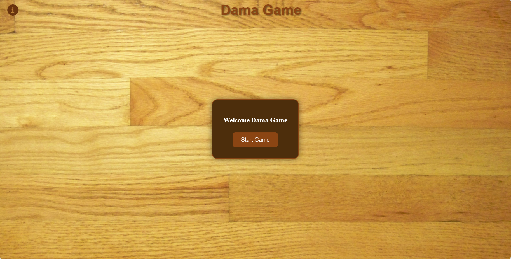
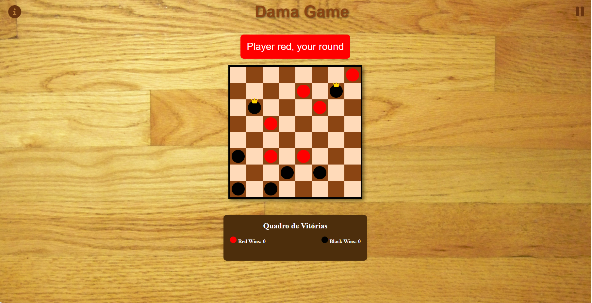

# Sales System
 

# About project

Dama Game - The goal of the project is to offer players a digital version of the game of checkers, providing a fun and challenging experience that faithfully recreates the rules and mechanics of the classic game. In addition, the project aims to practice and demonstrate skills in front-end web development, including HTML, CSS, and JavaScript.

## Layout web

### Welcome page

### Home

# Technologies 
- HTML
- CSS
- JavaScript
- DOM (Document Object Model)

# Code documentation

### Global Variables
- selectedPiece: Stores the selected piece by the player.
- currentPlayer: Stores the color of the current player (red or black).
- redWins: Stores the number of wins for the red player.
- blackWins: Stores the number of wins for the black player.
- gameOver: Indicates whether the game is over.

### Main Functions
- startGame(): Starts the game, hiding the welcome screen and displaying the game board.
- createBoard(): Creates the game board and positions the initial pieces.
- createPiece(color): Creates a piece with the specified color.
- selectPiece(piece): Selects a piece for movement.
- movePiece(cell): Moves the selected piece to the clicked cell.
- updateBoard(): Updates the game board.
- isValidMoveForPlayer(row, col, selectedRow, selectedCol, player): Checks if a move is valid for the current player.
- updateTurnDisplay(): Updates the display to indicate the current player's turn.
- checkWinner(): Checks for a winner after each move.
- continueGame(): Resumes the game after pausing.
- resetGame(): Restarts the game.
- updateWinsPanel(): Updates the wins panel with the current number of wins for each player.
- toggleMenuScreen(): Shows or hides the pause menu.
- toggleInfoScreen(): Shows or hides the information screen.

### Event Listeners
- keydown: Checks if the pressed key is the "Esc" key to open or close the pause menu.
- click (info button): Toggles the display of the information screen.

## Final Notes
The code uses DOM manipulation to interact with HTML elements and CSS for styling. It implements the basic rules of the Checkers game and keeps track of the game state, including player turns and win counts.

# Author

Rian Carlo Santana dos Santos

- Github: [@howisrian](https://www.github.com/howisrian)
- Linkedin: [Rian Santos](https://www.linkedin.com/in/santos-rian/)
