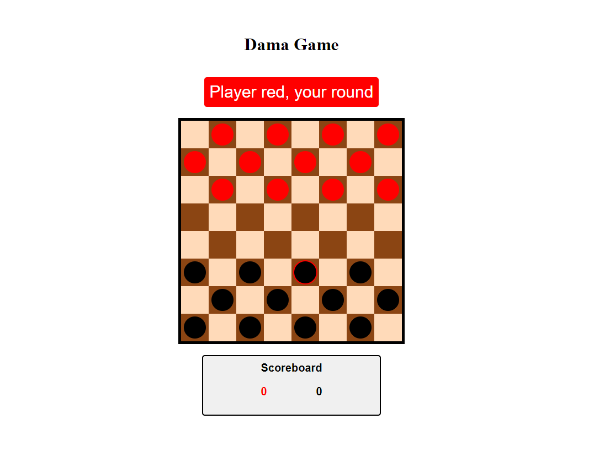
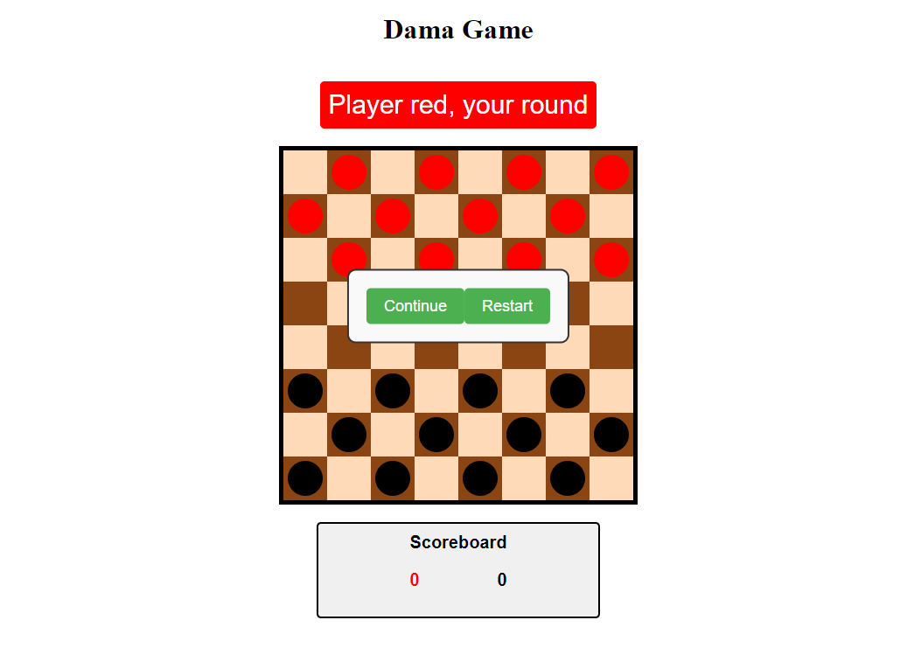

# Sales System
 

# About project

Dama Game - The goal of the project is to offer players a digital version of the game of checkers, providing a fun and challenging experience that faithfully recreates the rules and mechanics of the classic game. In addition, the project aims to practice and demonstrate skills in front-end web development, including HTML, CSS, and JavaScript.

## Layout web

### Home

### Menu

# Technologies 
- HTML
- CSS
- JavaScript
- DOM (Document Object Model)

# functions

This code implements a simple checkers game with the following functionalities:

### Game Start: 
When the startGame() function is called, the welcome screen is hidden, and the game screen is displayed. This is done by changing the CSS styles of the corresponding elements.

### Board Creation: 
The createBoard() function is responsible for creating the game board. It creates the cells of the board (divs) and the checker pieces (divs with specific CSS classes) at the initial positions.

### Piece Selection: 
When clicking on a piece, the selectPiece(piece) function is called to highlight the selected piece. This is done by adding and removing the 'selected' CSS class from the piece.

### Piece Movement: 
When a cell is clicked, the movePiece(cell) function is called to move the selected piece to that cell if the move is valid according to the game rules.

### Board Update: 
The updateBoard() function is called to clear and recreate the board after each move.

#### Winner Check: 
The checkWinner() function is called after each move to check if one of the players has won the game. If a player runs out of pieces, the game ends, and a message is displayed on the menu screen.

### Game Reset: 
The resetGame() function is called to restart the game when the "Restart" button is clicked on the menu screen. This clears the board, recreates the pieces, and resets the game status.

### Wins Panel Update: 
The updateWinsPanel() function updates the number of wins for each player displayed on the screen.

### Menu Screen Toggle: 
The toggleMenuScreen() function is used to toggle the display of the menu screen between visible and hidden. The screen remains visible when the Esc key is pressed.
Additionally, the code also includes the logic to alternate between players, display the current player on a display element, and respond to the Esc key to show/hide the menu screen.

# Author

Rian Carlo Santana dos Santos

- Github: [@howisrian](https://www.github.com/howisrian)
- Linkedin: [Rian Santos](https://www.linkedin.com/in/santos-rian/)
